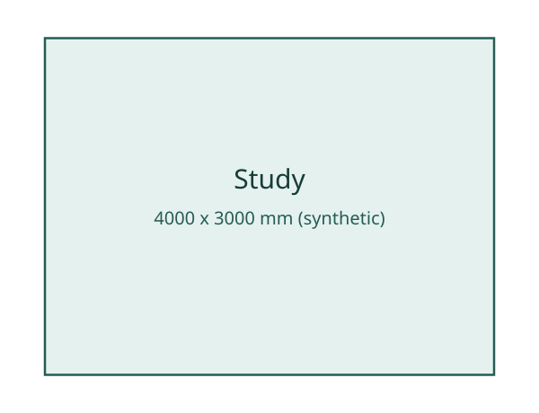
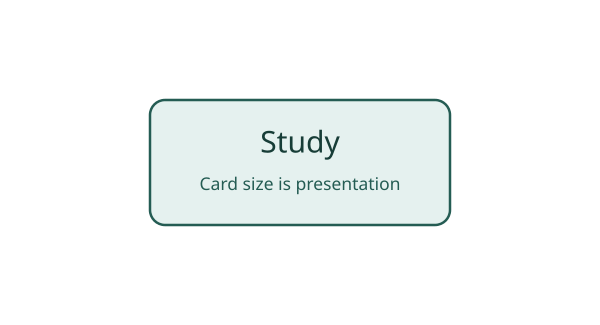

# One room, two views

This small synthetic project demonstrates `entity != representation`. One room appears in a physical plan and a
diagrammatic card. It uses the existing Building profile; it does not introduce new semantics.

| Property              | Physical plan                                   | Diagrammatic card                                 |
|-----------------------|-------------------------------------------------|---------------------------------------------------|
| File                  | [room-plan.sema.svg](room-plan.sema.svg)        | [room-card.sema.svg](room-card.sema.svg)          |
| Entity ID             | `room-study`                                    | `room-study`                                      |
| Type                  | `building:space`                                | `building:space`                                  |
| SVG representation ID | `repr-room-study-plan`                          | `repr-room-study-card`                            |
| Coordinate mode       | `physical`, `mm`                                | `diagrammatic`                                    |
| Rectangle dimensions  | 4000 x 3000 millimeters in the synthetic design | 240 x 100 drawing units, with no physical meaning |





The plan shows only a room's usable floor area. It is a partial view, with no modeled walls or openings. All dimensions
are intentionally synthetic and are not measurements of a real property.

Moving or resizing the diagrammatic card changes its presentation. Moving or resizing the room rectangle in the physical
plan changes the represented physical geometry. Neither operation changes the room's identity.

Each SVG has a view-wide `<title>` and `<desc>`, and the room rectangle has its own pair. The room's titles and notes
differ between views because they describe each representation; `data-sema-name="Study"` remains the same entity name.
These native texts are optional and do not change the visible labels or create additional entities. See
[Core's title and description convention](../../../spec/core.md#181-native-titles-and-descriptions).

From the repository root, after installing the validator:

```bash
semasvg validate examples/minimal/two-views
semasvg inspect-graph examples/minimal/two-views --entity room-study
```

The graph contains one entity with two representations and no entity-to-entity edges. Labels are not separate entities.
Each SVG also validates on its own because its references resolve locally. Use the manifest to inspect both views as one
project. Graph inspection preserves authored semantic attributes; it does not calculate room dimensions or area.
