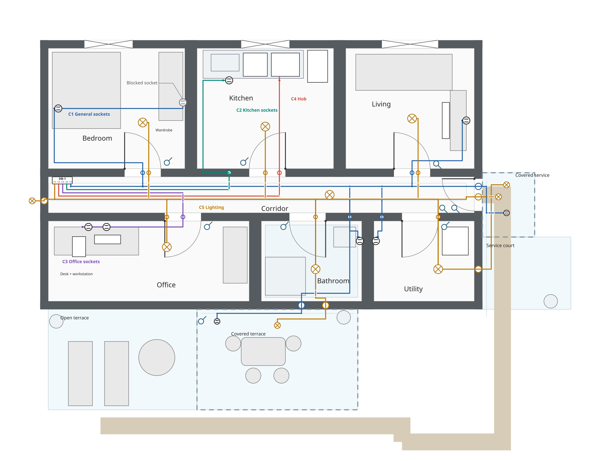
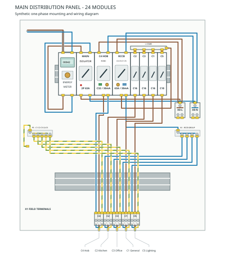
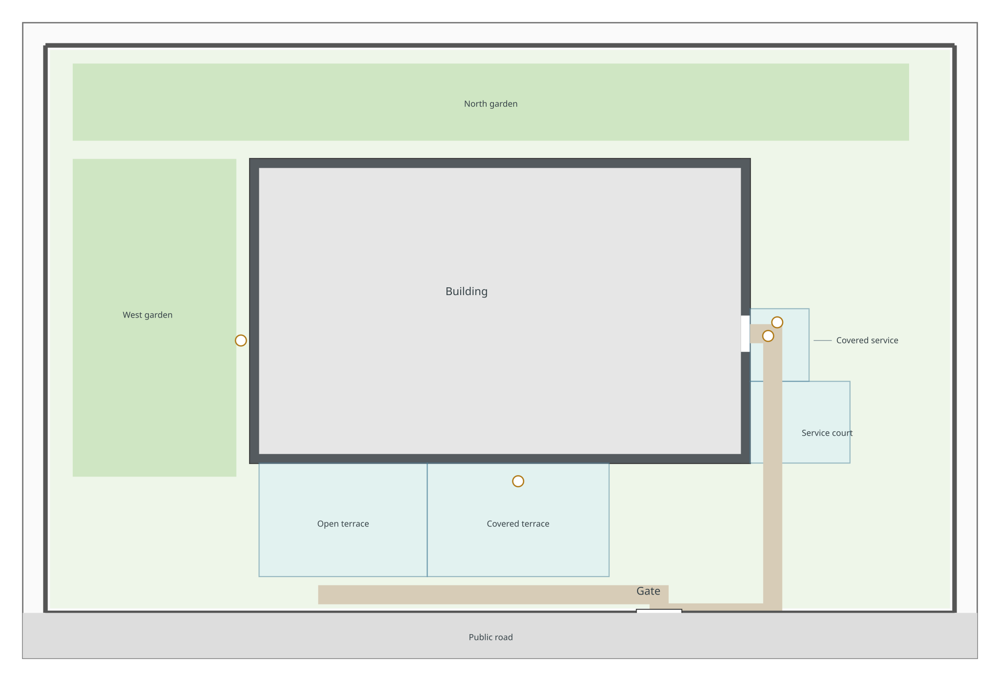
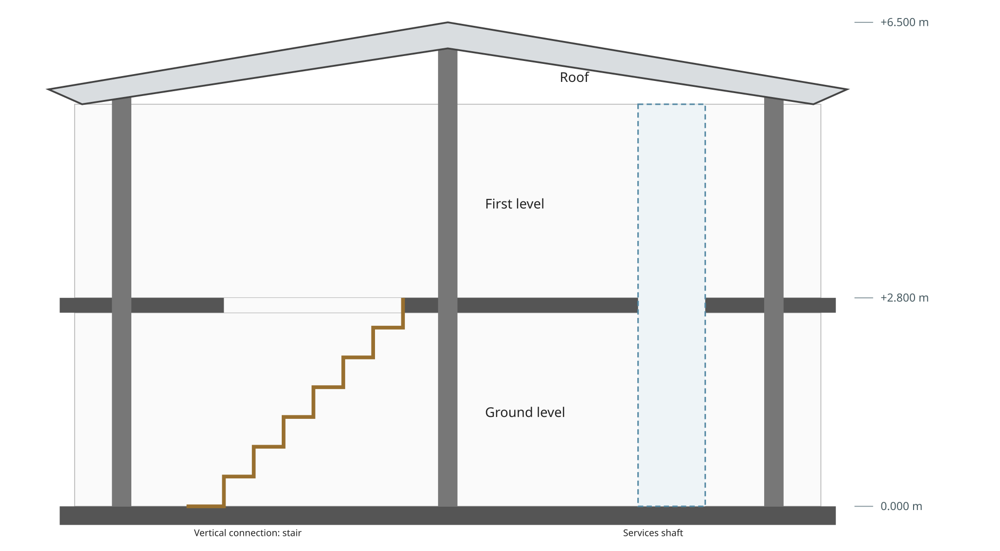

# Renovation demo

This public synthetic project demonstrates shared entity identity across the SVG views declared by its manifest. It is
planning material, not a survey, design approval, installation record, or engineering assessment.

| View ID             | File                         | Responsibility                                                                                                                    |
|---------------------|------------------------------|-----------------------------------------------------------------------------------------------------------------------------------|
| `site-plan`         | `site-plan.sema.svg`         | Macro site, parcel, footprint, exterior zones, fences, gate, paths, and exterior lights.                                          |
| `ground-floor`      | `ground-floor.sema.svg`      | Detailed floor and outdoor planning geometry, furniture, devices, routes, pathways, and roofs.                                    |
| `building-section`  | `building-section.sema.svg`  | Synthetic vertical building context.                                                                                              |
| `panel-main-layout` | `panel-main-layout.sema.svg` | Physical panel geometry and source-authored electrical system, supply, devices, terminals, conductors, cables, and circuit roots. |

The site and floor use the same outdoor entity IDs. Their geometry follows a local two-view convention: shared floor
coordinates are translated by `+5000,+3000` in the site plan; this is not a global coordinate contract. The panel has
outgoing cables C1 for general sockets, C2 for kitchen sockets, C3 for office sockets, C4 for the hob, and C5 for
ground-floor lighting. Floor branches remain separate cable entities, including C1 and C5 where they share a corridor or
exterior pathway. Routes, hosts, penetrations, circuits, cables, loads, and switch controls are explicit semantic
relationships; color and labels are presentation only.

The floor plan names circuits directly beside their routes instead of using a separate legend. Routes are painted first,
their non-connecting crossover marks next, and the original device symbols above them. White device faces hide the
portion of a route inside the circle while its physical endpoint stays unchanged. Light crosses keep a consistent
orientation. Labels and callouts are painted last; there are no duplicate visible device copies.

Selected C5 routes use decorative display offsets to keep the lighting and socket lines distinguishable in the bathroom,
covered terrace and covered service area. The source route paths retain their coordinates with `stroke-opacity="0"`;
four intermediate C5 pathway-node markers are also transparent. The group `electrical-route-display-offsets` is
explicitly `decoration`. Its spacing does not establish physical cable separation or channel width: the exterior
pathways still specify centerlines only. Crossover gaps indicate no connection.

When editing these routes, update the corresponding decoration and preserve its endpoints:

| Display path                         | Physical source routes                                                                          |
|--------------------------------------|-------------------------------------------------------------------------------------------------|
| `display-lighting-bathroom-to-south` | `route-terrace-c5-to-exterior-penetration`                                                      |
| `display-lighting-terrace`           | `route-terrace-c5-pathway-approach`, `route-exterior-south-c5`, `route-terrace-c5-pathway-drop` |
| `display-lighting-service`           | `route-service-c5-pathway-approach`, `route-exterior-east-c5`, `route-service-c5-pathway-drop`  |

The bedroom, living-room, office and utility switches are placed on the latch side of the illustrated doors. Kitchen and
bathroom switches already occupy that side. Both entrance controls sit on `wall-corridor-bottom` outside the illustrated
entrance swing, rather than in the doorway. Relocated positions are planned synthetic estimates; door geometry, circuit
membership and control targets are unchanged. Every switch, including the terrace and exterior-light controls, uses a
circle with a projecting stroke. Larger colored rings on walls are cable penetrations, not switches.

The panel uses the same terminal anchors and conductor paths as before its visual polish. Lighter wire strokes, longer
diagonal PE color bands and labels below the outgoing terminals improve readability without changing connectivity. Wire
stroke width is illustrative and does not encode conductor cross-section. Site zones have direct labels, and the section
shows selected elevations from its existing vertical metadata.

Panel topology is source-authored through the physical panel layout and floor relationships, while the ground floor
retains cable routes and loads. Inspect the validated project graph without inferring topology:

```bash
semasvg inspect-graph examples/reference/renovation-demo --entity circuit-hob --depth 3
```

The planned exterior roofs, furniture, fixtures, pathways, routes, sockets, lights, and switches are marked `planned`,
`estimated`, and `synthetic-design`. There is no terrace door or direct indoor terrace access: exterior areas are
reached through the yard and existing east entrance. The illustrative `IP44` values are synthetic facts, not suitability
claims. The intentionally blocked bedroom socket remains a planning conflict. Nothing in this example establishes
electrical-code compliance, conductor sizing, protection selectivity, installation safety, or engineering approval.

## Human notes and vertical context

The floor plan and building section have native SVG `<title>` and `<desc>` children describing the whole view. The
bedroom bed and selected lighting objects have only a title, the worktop and selected appliances have only a
description, and the wardrobe has both. These are independent optional elements on individual semantic roots. The
wardrobe note explains the intentionally unresolved socket-access conflict. These texts do not change the drawing or
replace semantic relationships. See
[Core's title and description convention](../../../spec/core.md#181-native-titles-and-descriptions).

Vertical metadata is already present on walls, openings, sockets, and selected building and route elements. For example,
the kitchen window spans Z 1000 to 2100 mm, while the kitchen worktop socket has its center at Z 1100 mm. These are
different concepts: an object's vertical extent and a mounting reference point.

The Building profile uses the containing level's finished floor as the default datum. The section explicitly declares
`data-sema-z-datum="level-ground"`; its drawing maps Z to SVG Y with `Y = 6800 - Z`. Many furniture and device
representations still omit vertical metadata. Their SVG `height` in the floor plan measures an XY footprint dimension,
not physical object height. Missing Z is unspecified, not zero, and the baseline validator does not establish 3D
clearance.

Four objects demonstrate deliberately synthetic vertical assumptions, locally marked `estimated` and `synthetic-design`:

| Entity                       | Vertical data       | Planning meaning                                                                                                         |
|------------------------------|---------------------|--------------------------------------------------------------------------------------------------------------------------|
| `furniture-bedroom-wardrobe` | Z 0 to 2400 mm      | Its vertical extent includes the existing blocked socket's center at 300 mm.                                             |
| `fixture-kitchen-worktop`    | Z 860 to 900 mm     | A 40 mm worktop slab; its upper face is 200 mm below the worktop socket's center. Supporting cabinets are not modeled.   |
| `switch-bedroom-main`        | Center at Z 1100 mm | A mounting reference, separate from its control relationship to the bedroom light.                                       |
| `light-bedroom-main`         | Top at Z 2500 mm    | Matches the existing incoming branch route's elevation. The light's body depth and mounting hardware remain unspecified. |

The wardrobe's local certainty summary is now `estimated` because it includes the added synthetic Z extent; its existing
footprint is unchanged. These values illustrate the format, not measurements or recommended installation dimensions. The
switch's control relationship is declared, but its control wiring and vertical cable drop are not modeled.

## Physical opening geometry

Each of the ten floor-plan door and window groups marks its opening rectangle as `data-sema-role="geometry"`. This
rectangle is the void in the host wall within the opening's declared Z range. Leaves, swing arcs, hinge dots and window
marks use `decoration`; they do not enlarge that void or establish physical leaf or clearance dimensions. Existing
coordinates and drawing styles are unchanged.

## Intentionally incomplete appliance connections

The floor plan includes appliances to show planning obstacles and intended uses. Only the hob currently has an explicit
appliance circuit assignment and a traced supply route. The dishwasher and washing machine declare
`data-sema-dedicated-line="true"` as intent, but their circuits, protection and routes are intentionally outside this
example. The refrigerator, computer, monitor and television also have no modeled appliance-to-supply connections. Nearby
sockets and shared spaces do not establish those connections automatically. Local appliance notes make the
dedicated-line omissions visible when inspecting those objects.

The five declared circuits C1-C5 cover the modeled sockets, lights and hob. Their topology and XY route continuity can
be checked independently of the omitted appliance connections. The model is not a complete electrical installation or a
complete 3D cable layout; unmodeled control wiring, device connection details and vertical transitions remain outside
that check.

## Synthetic section adjustments

The central column follows the existing roof soffit up to Z 6150 mm; the contact profile is rounded to millimeters. Its
added height is an estimated synthetic assumption. `opening-stair-first` explicitly removes the first-floor slab over
the illustrated stair flight, with `slab-first` as host and both served levels referenced. The stair meets the slab edge
at the first-floor elevation. These changes do not establish structural joints, load capacity, stair ergonomics or
headroom compliance. The services shaft's detailed slab penetrations remain unmodeled.

## SVG views

The views below display the source SVG files directly. Each drawing includes a white background for readability on light
and dark pages. Viewing an SVG image does not verify editor round trips or interactive tooltips.








